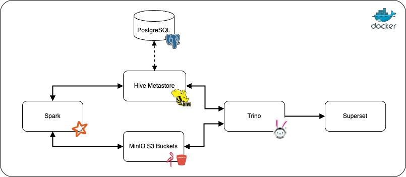
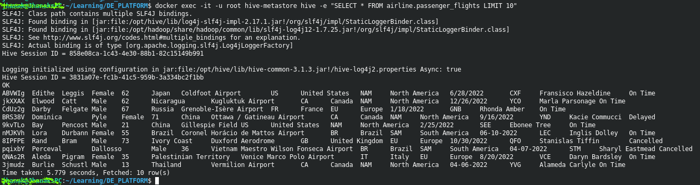
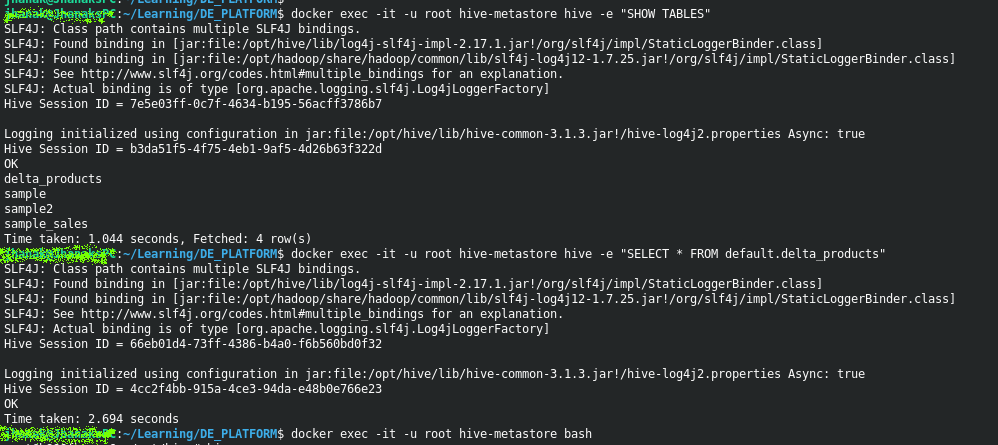
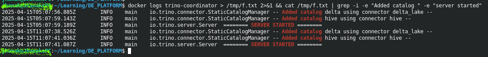
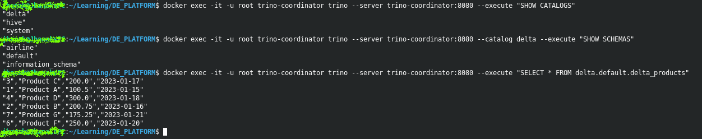
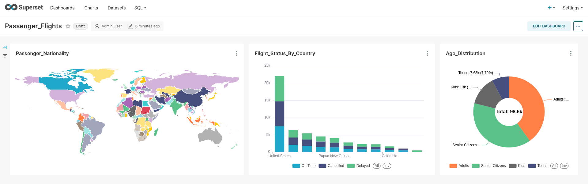

# 🚀 Docker-Based Modern Data Platform


[](https://www.docker.com/)
[](https://spark.apache.org/)
[](https://trino.io/)

A containerized data platform stack featuring distributed processing, SQL analytics, and data visualization.

## ✨ Overall Architecture 


## 🌟 Key Features

| **Component**             | **Description**                                      |
|---------------------------|------------------------------------------------------|
| **S3 Bucket Storage**     | MinIO for object storage with bucket management      |
| **Metadata Management**   | Hive Metastore (HMS) for ***unified*** table metadata      |
| **Distributed Processing**| Spark cluster with Delta Lake integration            |
| **SQL Analytics**         | Trino MPP engine for federated queries               |
| **Visualization**         | Apache Superset for dashboard creation               |
| **Containerization**      | Docker compose for service orchestration             |

## 🌐 Service Access Points

| Service               | Web UI URL                          | Default Credentials (if any)       |
|-----------------------|-------------------------------------|------------------------------------|
| **MinIO Console**     | http://localhost:9000               | `minioadmin` / `minioadmin`        |
| **Spark Master UI**   | http://localhost:8080               | -                                  |
| **Trino UI**          | http://localhost:8080/ui/           | -                                  |
| **Superset**          | http://localhost:8088               | `admin` / `admin`                 |
| **Hive Metastore**    | (Thrift: localhost:9083)            | -                                  |
| **PostgreSQL (HMS)**  | (JDBC: localhost:5432)              | Configurable in `.env`            |

### Notes:
1. All services bind to `localhost` by default
2. Ports can be customized in the respective `docker-compose-*.yml` files
3. For production, secure all credentials and enable HTTPS


## 📂 Project Structure
```
.
├── data/                                 # PERSISTENT VOLUMES
│   ├── hive_data/                          # Hive metadata
│   ├── minio_data/                         # MinIO storage
│   ├── spark_data/                         # Spark data
│   ├── superset_data/                      # Superset data
│   └── trino_data/                         # Trino configs
├── docker/                               # SERVICE CONFIGS
│   ├── hive-metastore/                     # HMS setup
│   ├── minio/                              # MinIO storage - test scripts & sample data 
│   ├── spark/                              # Spark configs & test scripts
│   ├── superset/                           # Superset init and cdatasources configs
│   └── trino/                              # Trino setup - catalog configs and property
├── docker-compose/                       # COMPOSE FILES
│   ├── docker-compose-base.yml             # Dummy service - named volumes & network
│   ├── docker-compose-metastore.yml        # Hive Metastore service 
│   ├── docker-compose-processing.yml       # Spark cluster service - 1 master 2 workers
│   ├── docker-compose-query.yml            # Trino cluster - 1 coordinator 2 workers
│   ├── docker-compose-storage.yml          # MinIO service
│   └── docker-compose-visualization.yml    # Superset service - uses Redis service for caching
├── .env                                  # Environment file; used in docker-compose ├── yaml files
├── setup.sh                              # Defines functions for easy service management
├── notes.txt                             # Scratch notes from my experiments
└── README.md                             # README file :)
```

## 🚀 Getting Started

### Prerequisites
- Docker 20.10+ & Docker Compose 2.15+
- 8GB+ RAM
- Bash shell

### Installation
```bash
git clone https://github.com/krohit-bkk/de_platform.git de-platform
cd de-platform
chmod +x setup.sh
source setup.sh
prep_folders  # Create directories
start_all     # Start all services
```

## 🔍 Platform Components

### 1. MinIO Object Storage
- **URL**: http://localhost:9000
- **Credentials**: minioadmin/minioadmin
- **Features**:
  - S3-compatible storage
  - Houses raw data, Hive table data and Delta tables
  - Managed via minio-client

### 2. Hive Metastore (HMS)
- **Port**: 9083 (Thrift)
- Metastore URI: thrift://hive-metastore:9083 
- **Backend**: PostgreSQL
- **Access**:
  ```bash
  docker exec -it hive-metastore hive
  ```

### 3. Spark Cluster
- **Master UI**: http://localhost:8080
- **Capabilities**:
  - Batch processing
  - Delta Lake support
  - HMS integration

### 4. Trino Cluster
- **UI**: http://localhost:8080/ui/
- **Capabilities**:
  - Distributed SQL Query Engine (MPP architecture)
  - Capability to connect to variety of data sources
  - Connects with HMS for catalog and read data from MinIO S3 buckets
- **Catalogs**:
  ```sql
  SHOW CATALOGS;  # hive, delta, etc.
  ```

### 5. Apache Superset
- **URL**: http://localhost:8088
- **Capabilities**:
  - Data exploration and visualization tool
  - Capability to connect to variety of data sources
  - Connects with Trino to read Hive/Delta tables
- **Credentials**: admin/admin
- **Setup**:
  1. Use **docker-compose** to start ***superset*** service 
  2. Create ***datasets*** from HMS/Delta tables
  3. Create ***Charts*** and add them to ***Dashboards***

## 🔧 Setting things up 

### 1. Create named volumes and docker network for this project  
Creates the named volumes and docker network by spawning a ***dummy*** service. The named volumes are - `hive_data`, `spark_data`, `minio_data`, `trino_data` and `superset_data`. These persisted volumes are mounted on respective services in this setup.
```bash
docker-compose --env-file .env.evaluated -f ./docker-compose/docker-compose-base.yml up -d
```

### 2. Start MinIO Service and setup S3 buckets
Start the main MinIO service
```bash
docker-compose --env-file .env.evaluated -f ./docker-compose/docker-compose-storage.yml up -d minio 
```
Once the MinIO service is up, you should be able to see the WebUI at http://localhost:9000.

Now proceed to run the MinIO client service, which creates multiple buckets and loads sample files into `s3a://raw-data/sample_data/` and `s3a://raw-data/airline_data/`. These files will later be referenced by Hive tables.

```bash
docker-compose --env-file .env.evaluated -f ./docker-compose/docker-compose-storage.yml up -d minio-client
```

### 3. Start Hive MetaStore (HMS)
Start the Hive MetaStore (HMS) service using command:
```bash
docker-compose --env-file .env.evaluated -f ./docker-compose/docker-compose-metastore.yml up -d hive-metastore 
```
You can use the below command to check the service logs to debug errors (press `Ctrl + C` to exit log stream):
```bash
docker logs -f hive-metastore
```
As a part of setting up HMS, the script `./docker/hive-metastore/init-schema.sh` would also create a table named - `airline.passenger_flights`. This table would be used in Superset to create a sample dashboard towards the end of the setup.

Once, the hive Metastore service is ready, you can log in to the service and query for the table that we just created as a part of HMS setup.
```bash
docker exec -it -u root hive-metastore hive -e "SELECT * FROM airline.passenger_flights LIMIT 10"
```


Congrats! HMS service is up and running, and able to read/write data from MinIO S3 bucket.

### 4. Start the Spark cluster
The docker-compose file for managing Spark cluster is `docker-compose-processing.yml`. Starting the Spark cluster is fairly straight forward:
```bash
docker-compose --env-file .env.evaluated -f ./docker-compose/docker-compose-processing.yml up -d spark-master spark-worker-1 spark-worker-2 
```
You can use the below command to check the status of `spark-master` service using:
```bash
docker logs -f spark-master
```

Once the Spark cluster is up. You might want to test the Spark-HMS integration using service - `test-spark`
```bash
docker-compose --env-file .env.evaluated -f ./docker-compose/docker-compose-processing.yml up -d spark-test
```
The above job would submit a Spark job to the Spark cluster we just created and create a table `default.sample_sales` in Hive (with it's data residing in MinIO S3 bucket). You can check the contents of this table just like we did while setting up HMS service:
```bash
docker exec -it -u root hive-metastore hive -e "SELECT * FROM default.sample_sales LIMIT 10"
```

Let us also test whether our Spark setup is capable of creating a **Delta Lake**. This will leverage `delta` files and provide us with advanced capabilities, including but not limited to ***data versioning***, ***ACID transactions***, and ***time travel***. We have a service named `delta-lake-test` which can help simulate the Delta Lake capabilities for us using a table named `delta_products`. Let's fire it up:
```bash
docker-compose --env-file .env.evaluated -f ./docker-compose/docker-compose-processing.yml up -d delta-lake-test
```

Check for container logs using command:
```bash
docker logs -f delta-lake-test
```
> Please note that the sample execution output is shared in notes.txt. Not capturing it here because of the sheer length of console output.

Let us try to check if the table `default.delta_products` exists by running:
```bash
docker exec -it -u root hive-metastore hive -e "SHOW TABLES"
docker exec -it -u root hive-metastore hive -e "SELECT * FROM default.delta_products"
```

Oops! Why don't we see the table data?
Actually, this is an **expected behaviour**. Hive doesn't support `delta` files by default, but it can manage the metadata for the table though.
We will use this metadata from HMS and try to read the table in Trino. So let us bring our Trino up!

### 5. Start the Trino cluster
Trino is an open-source distributed SQL query processing engine which is built on ***Massively Parallel Processing (MPP)*** architecture, and its cluster has ***coordinator*** and ***worker*** nodes. We will spin up a cluster for Trino with one coordinator service - `trino-coordinator` and two worker services - `trino-worker-1` & `trino-worker-2`. The docker-compose file for managing Trino cluster is `docker-compose-query.yml`. Starting the Trino cluster is very straight forward too:
```bash
docker-compose --env-file .env.evaluated -f ./docker-compose/docker-compose-query.yml up -d trino-coordinator trino-worker-1 trino-worker-2
```

Debug logs can be found in `trino-coordinator` service logs:
```bash
docker logs -f trino-coordinator 
```
or 
```bash 
docker logs trino-coordinator > /tmp/f.txt 2>&1 && cat /tmp/f.txt | grep -i -e "Added catalog " -e "server started"
```


Here, you can see that we are able to add both Hive and Delta Lake catalog in Trino. Let us read the delta table `default.delta_products` we created earlier:
```bash
# Show all catalogs available
docker exec -it -u root trino-coordinator trino --server trino-coordinator:8080 --execute "SHOW CATALOGS"
# Show all schemas available within a catalog
docker exec -it -u root trino-coordinator trino --server trino-coordinator:8080 --catalog delta --execute "SHOW SCHEMAS"
# Show data from table inside a schema inside a catalog 
docker exec -it -u root trino-coordinator trino --server trino-coordinator:8080 --execute "SELECT * FROM delta.default.delta_products"
```


Trino is now fully setup and tested for connectivity with our HMS service.

### 6. Starting the Superset
Apache Superset is a modern, open-source data exploration and visualization platform designed for creating interactive dashboards and rich analytics. It supports a wide range of databases and empowers users to analyze data through a no-code interface or SQL editor. Let us start our service which is defined in `docker-compose-visualization.yml`:
```bash
docker-compose --env-file .env.evaluated -f ./docker-compose/docker-compose-visualization.yml up -d superset
```
**Optional Redis Setup**: Superset can use Redis for enhanced caching:
1. Edit `init-superset.sh`
2. Swap the commented/uncommented sections for Redis
3. The setup will automatically apply when services restart

Once the Superset service is up, you can explore the tool and build cool visualization by sourcing data from Trino. 
I am sharing below a screenshot from a sample dashboard that I built on table - `airline.passenger_flights`.
The data for this table is put in it's designated location when service `minio-client` runs and the create table DDL runs when when HMS service sets up.



This experiment covers end to end setup of our data platform, where we have MinIO service for storage, Spark as main processing engine, Hive Metastore for metadata management, Trino for data access and Superset as BI/Visualization layer. 

This setup can be further extended by adding a scheduler like Apache AirFlow to further automate (and simulate) scheduled data processing that reflects end to end in our Superset dashboard.

## 🛠️ Maintenance Commands
The `setup.sh` script includes preconfigured helper functions for easier platform management:

### Core Operations
| Command               | Description                                  |
|-----------------------|----------------------------------------------|
| `start_all`           | Start all platform services                 |
| `clean_all`           | Stop and remove all containers + cleanup    |
| `prep_folders`        | Recreate data directories with permissions  |

### Component Management
| Command               | Description                                  |
|-----------------------|----------------------------------------------|
| `reset_minio`         | Reinitialize MinIO storage                  |
| `reset_superset`      | Wipe and reinitialize Superset              |
| `start_trino`         | Restart Trino cluster                       |
| `stop_superset`       | Shut down Superset services                 |

### Testing & Debugging
| Command               | Description                                  |
|-----------------------|----------------------------------------------|
| `test_spark_hive`     | Test Spark-Hive integration                 |
| `test_spark_delta`    | Test Spark-DeltaLake integration            |
| `test_trino`          | Test Trino with HMS                         |
| `run_minio_client`    | Run MinIO client for bucket setup           |

### Monitoring
| Command               | Description                                  |
|-----------------------|----------------------------------------------|
| `psa`                 | Show all containers (`docker ps -a`)        |
| `all`                 | Show containers + networks + volumes        |
| `nv`                  | List networks and volumes                   |
| `rma`                 | Remove all containers (`docker rm -f`)      |

> **Note**: Replace placeholders in `.env` before deployment. Secure credentials for production use.
